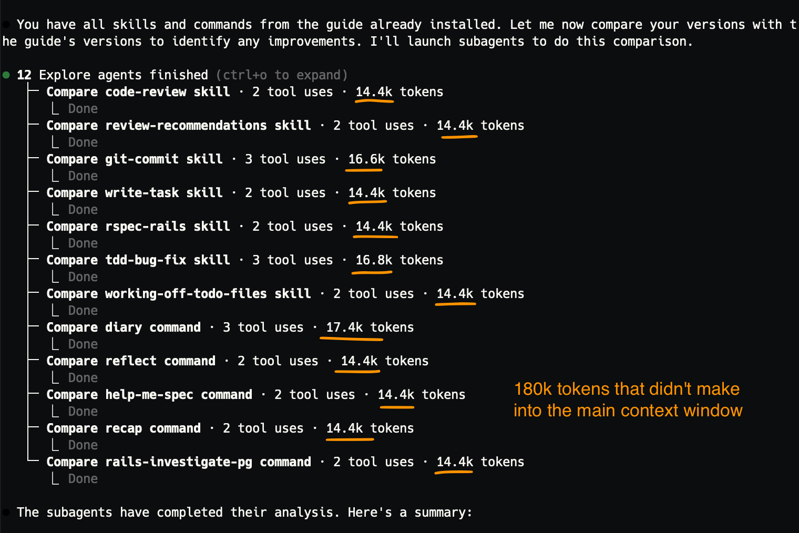
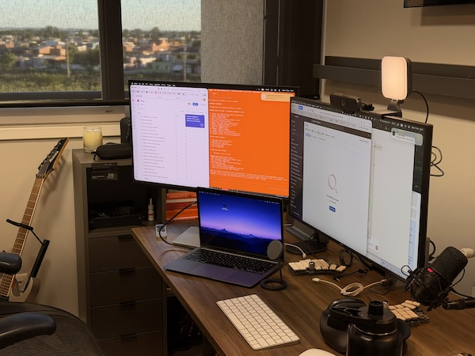

# Jan 2026: Quick Claude Code Setup

Skills and commands that make Claude Code significantly better at writing
production code. Copy-paste to get started. Don't forget to set up
your CLAUDE.md afterwards instruct the LLM to call those skills automatically.

**Protip:** copy/paste into Claude,

```
Read https://github.com/kurko/dotfiles/blob/master/docs/jan-2026-claude-code-setup.md

- Install it automatically for me. Make sure CLAUDE.md is updated at the global level.
- Use subagents to compare with skills I already have, and suggest improvements
  to my own Markdown files instead of replacing them.
- Ask me for confirmation before installing each skill or command. Use
  the AskUserQuestion tool for EVERY question.
- Don't install annoying-claude though. I'll look at the separately.
```

[↘︎ Skip to CLAUDE.md](#claude-md-setup)<br>
[↘︎ Skip to Why use subagents](#why-subagents)<br>
[↘︎ Skip to Claude attention alert](#annoying-claude)

## Core Skills

**What are skills?**

Skills are markdown files read automatically by the AI during its workflow. They
run in subagents (new context, unbiased) when instructed, and help self-correct
from hallucinations or drifting from the goal. In practice, it will make Claude
run for longer without human intervention (4-5x in my experience), and produce
higher quality code.

**How skills change my workflow?**

For the `code-review` skill, I wrote down every aspect I could remember I
used during my career when reviewing pull requests. Now, whenever someone asks
me for review, I run this skill first locally.

Protip: I also review the PR myself. When there are discrepancies, I ask Claude
to "read my comments in <pr-url>, generalize them, and improve the code-review
skill so next time you catch these issues automatically".

**How to**

- `code-review`: reviews PRs and diffs, comparing initial intent to final code.
- `review-recommendations`: reviews config or optimization suggestions
  before applying them.

```bash
mkdir -p ~/.claude/skills/code-review \
  ~/.claude/skills/review-recommendations

curl -sL https://raw.githubusercontent.com/kurko/dotfiles/master/ai/skills/code-review/skill.md \
  -o ~/.claude/skills/code-review/skill.md

curl -sL https://raw.githubusercontent.com/kurko/dotfiles/master/ai/skills/review-recommendations/skill.md \
  -o ~/.claude/skills/review-recommendations/skill.md
```

## Commands

- `/diary` captures what happened in a session. `/reflect` analyzes diary entries
and proposes CLAUDE.md improvements. Together they create a learning loop.
- `/help-me-spec` interviews you to create detailed specs before building.
  Accepts arguments, e.g `/help-me-spec I want to work on this task <task-url>`.

```bash
mkdir -p ~/.claude/commands
curl -sL https://raw.githubusercontent.com/kurko/dotfiles/master/ai/commands/diary.md \
  -o ~/.claude/commands/diary.md

curl -sL https://raw.githubusercontent.com/kurko/dotfiles/master/ai/commands/reflect.md \
  -o ~/.claude/commands/reflect.md

curl -sL https://raw.githubusercontent.com/kurko/dotfiles/master/ai/commands/help-me-spec.md \
  -o ~/.claude/commands/help-me-spec.md
```

## CLAUDE.md Setup<a name="claude-md-setup"></a> (critical)

Skills need instructions in your CLAUDE.md to activate automatically.

**If you don't have a CLAUDE.md yet, copy mine:**
```bash
curl -sL https://raw.githubusercontent.com/kurko/dotfiles/master/ai/CLAUDE.md \
  -o ~/.claude/CLAUDE.md
```

**If you already have one**, add this snippet:

```markdown
## Skill Usage

- After writing code, ALWAYS run the `code-review` skill before committing
- Before suggesting optimizations or config changes, ALWAYS use
  `review-recommendations` to validate the advice is context-specific
- When writing Rails specs, ALWAYS use the `rspec-rails` skill
- When fixing bugs, FIRST READ the `tdd-bug-fix` skill to write a failing test first
- When working from `todo.md` or `todo.txt` files, use
  `working-off-of-todo-files` skill to guide your work
```

**Protip:** basic, but add this to your CLAUDE.md. It makes a huge difference in
helping the AI self-correct.

```
- ALWAYS run tests before committing code changes. We should never commit
  untested code. If linting is available, run linting as well.
```

## Bonus

The stuff below aren't critical, but I find them useful for my personal flow.

**Why use subagents?**<a name="why-subagents"></a>

When you tell the AI to use subagents, it moves that processing into separate,
unbiased agents with fresh context windows. Think of it like subprocesses where
memory isn't shared.



In this screenshot, 12 subagents ran in parallel to compare skills. Each used
~14-17k tokens in their own context window. That's ~180k tokens that never
entered the main context window.

The benefits:
- Longer sessions without hallucinations: your main context stays small and
  focused, so the AI doesn't lose track of the original goal
- Unbiased analysis: each subagent starts fresh, without being influenced by
  earlier assumptions in the conversation
- Parallel processing: subagents can run simultaneously, making complex
  comparisons faster

To trigger subagent usage, add instructions like "use subagents to compare" or
"spawn separate agents for each analysis" in your prompts.

Protip: make all your skills run in subagents.

**Attention alerts ([`annoying-claude`][annoying-claude-src]):**<a name="annoying-claude"></a>
First, I forget that Claude needs my attention and Mac's notifications aren't enough. Second, I want to be able to code in parallel.



I added a hook that turns my terminal orange when Claude needs input. Helpful
when you're multitasking. You'll notice immediately when Claude is waiting.

**More skills**

- `git-commit`: structures commit messages with problem/solution/future format.
- `write-task`: templates for writing clear task descriptions (Asana, Linear,
  Jira, etc).
- `rspec-rails`: guides the AI to write idiomatic, maintainable RSpec tests for
  Rails applications. My favorite.
- `tdd-bug-fix`: instructs the AI to always write a failing test _first_ when
  fixing bugs.
- `working-off-of-todo-files`: helps the AI prioritize and structure work when
  using `todo.md` or `todo.txt` files. I use for side projects.

```bash
mkdir -p ~/.claude/skills/git-commit \
  ~/.claude/skills/write-task \
  ~/.claude/skills/rspec-rails \
  ~/.claude/skills/tdd-bug-fix \
  ~/.claude/skills/working-off-of-todo-files

curl -sL https://raw.githubusercontent.com/kurko/dotfiles/master/ai/skills/rspec-rails/SKILL.md \
  -o ~/.claude/skills/rspec-rails/SKILL.md

curl -sL https://raw.githubusercontent.com/kurko/dotfiles/master/ai/skills/tdd-bug-fix/skill.md \
  -o ~/.claude/skills/tdd-bug-fix/skill.md

curl -sL https://raw.githubusercontent.com/kurko/dotfiles/master/ai/skills/working-off-of-todo-files/skill.md \
  -o ~/.claude/skills/working-off-of-todo-files/skill.md

curl -sL https://raw.githubusercontent.com/kurko/dotfiles/master/ai/skills/git-commit/skill.md \
  -o ~/.claude/skills/git-commit/skill.md

curl -sL https://raw.githubusercontent.com/kurko/dotfiles/master/ai/skills/write-task/skill.md \
  -o ~/.claude/skills/write-task/skill.md
```

**More commands**

- `/recap`: generates a summary for returning to a project after time away. Just
    summarizes the context window.
- `/rails-investigate-pg`: diagnoses basic PostgreSQL connection errors in Rails apps.

```bash
curl -sL https://raw.githubusercontent.com/kurko/dotfiles/master/ai/commands/recap.md \
  -o ~/.claude/commands/recap.md

curl -sL https://raw.githubusercontent.com/kurko/dotfiles/master/ai/commands/rails-investigate-pg.md \
  -o ~/.claude/commands/rails-investigate-pg.md
```

[annoying-claude-src]: https://github.com/kurko/dotfiles/blob/f2d0b1b637651cba1cef78bc1ec1a36e8577d75d/bash/alias/ai.bashrc#L240
